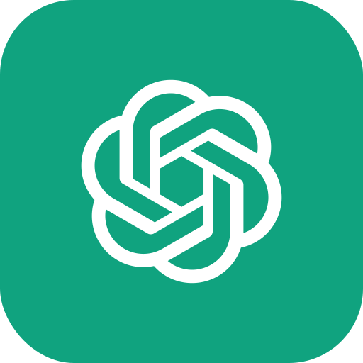
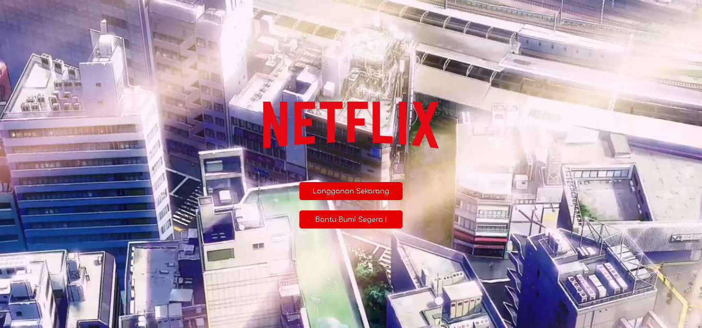
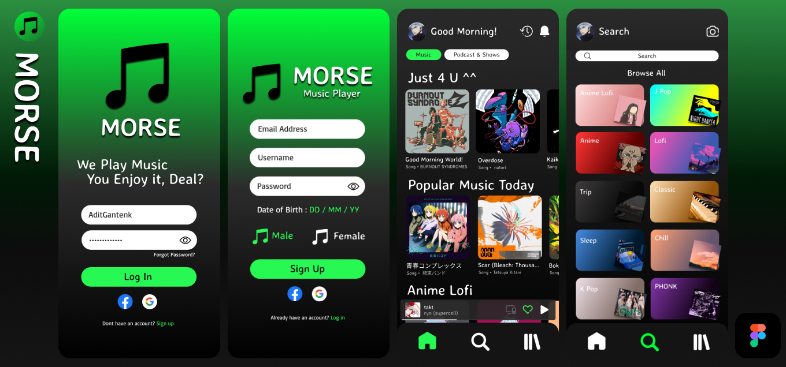
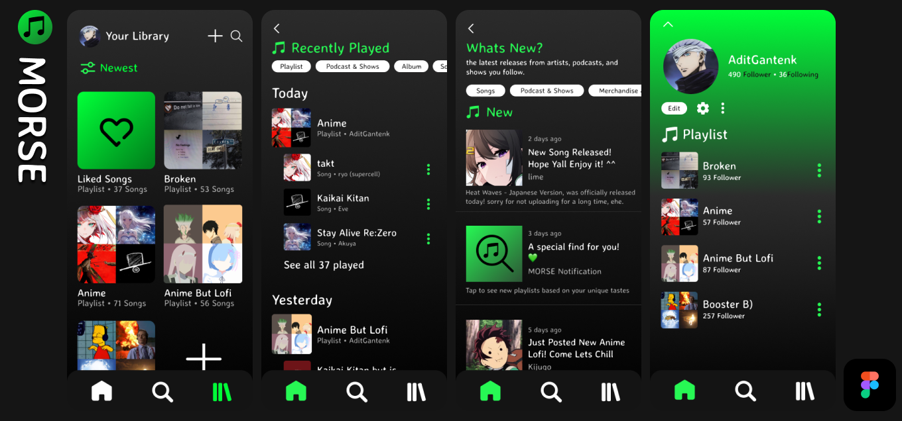
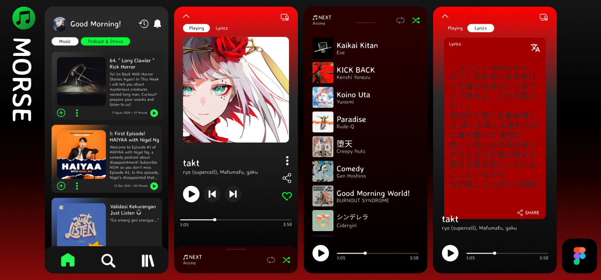

<!--suppress HtmlDeprecatedAttribute -->

# 🍞 Aditmyo! #

`Newbie Front End Developer`
`Re : Zero Lover`
`A fan of Japanese Culture`
 
`Anime Illustrator`
`Experienced Designer`
`Road to Japan`

# 👋 こんにちは ! #
My name is Raditya Anugrah Sagitaris! You can call me Adit, Adid, Radit, Anugrah, Sagitaris, or whatever you like. With over 1 year of experience as a Junior Front End Developer, I’ve honed my skills in designing cool and user-friendly UI/UX interfaces. I combine this expertise with my experience as a Creative Illustrator, where I’ve spent more than 2 years creating captivating anime, animations, and manga. My passion for AI further enriches my skills, making me proficient in using AI prompts to accelerate workflows and produce outstanding results. All these experiences and skills are supported by my use of design tools like Figma, Canva, and Clip Studio Paint, allowing me to create truly impressive works!

# ☕ 𝘔𝘢𝘪𝘯 𝘚𝘬𝘪𝘭𝘭𝘴 #

# 📔 𝘊𝘶𝘳𝘳𝘦𝘯𝘵𝘭𝘺 𝘓𝘦𝘢𝘳𝘯𝘪𝘯𝘨 #

# 📋 𝘍𝘶𝘵𝘶𝘳𝘦 𝘗𝘭𝘢𝘯𝘴 #

# 🤍 𝘔𝘺 𝘧𝘢𝘷𝘰𝘳𝘪𝘵𝘦 𝘵𝘰𝘰𝘭𝘴 𝘢𝘯𝘥 𝘵𝘦𝘤𝘩𝘯𝘰𝘭𝘰𝘨𝘪𝘦𝘴

<table align="center">
  <tr>
    <td align="center" width="96">
        
       HTML5
    </td>
    <td align="center" width="96">
      
       CSS3
    </td>
    <td align="center" width="96">
        
       JavaScript
    </td>
    <td align="center" width="96">
        
       Bootstrap
    </td>
    <td align="center" width="96">
        
       VS Code
    </td>
    <td align="center" width="96">
        
       Laravel
    </td>
    <td align="center" width="96">
        
       MySql
    </td>
    <td align="center" width="96">
        
       tailwind
    </td>
    <td align="center" width="96">
        
       Figma
    </td>
  </tr>
  <tr>
  <td align="center" width="96">
        
       Pinterest
    <td align="center" width="96">
        
       Github
    </td>
    <td align="center" width="96"> 
        
       Git
    </td>
    <td align="center"  width="96">
        
       Clip Studio
    </td>
    <td align="center"  width="96">
        
       R Studio
    </td>
    <td align="center" width="96">
        
       Canva
    </td>
    <td align="center"  width="96">
        
       ChatGPT
    </td>
  
  </tr>
</table>
 

  
# Recents Projects #

Here are some of the projects I've worked on! From graphic design and web development to cool illustrations, each project is a blend of creativity and technical skills that make them stand out and feel innovative. Let's dive in and check them out!
  

# Netflix Login Interface #

# MORSE #

# Reach out to me #

